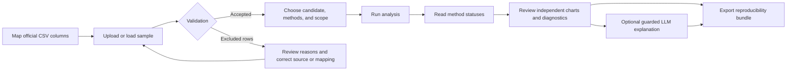
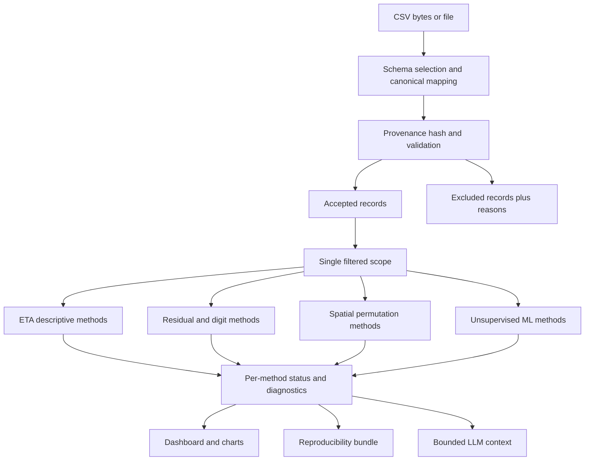
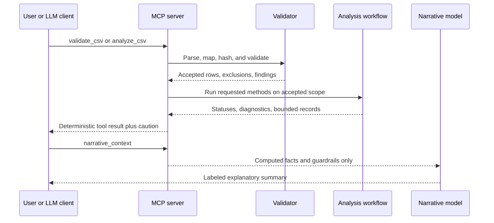

# Precinct Election Analysis: User Guide and System Walkthrough

This guide explains how to install, configure, operate, and interpret the application. All bundled
sample data is fictional.

> An anomaly is unusual under a stated model. It is not proof of fraud, misconduct, or an
> incorrect election outcome. Aggregate precinct analysis is not a risk-limiting audit of ballot
> evidence.

## Part I: Stepwise user instructions

### 1. Install the application

Open PowerShell in the repository and run:

```powershell
cd E:\election-analysis
py -3.12 -m venv .venv
.venv\Scripts\Activate.ps1
python -m pip install -e ".[dashboard,mcp,dev]"
```

Python 3.11 through 3.13 is supported. To enable OpenAI summaries, also run:

```powershell
python -m pip install -e ".[llm]"
```

### 2. Prepare the CSV and column mapping

Start with official precinct-level results. Preserve the original file separately. Edit the
`data.schema` section of `config.yaml` so every concept points to the corresponding source column.

Required concepts:

| Concept | Purpose |
|---|---|
| `jurisdiction` | County, municipality, or reporting jurisdiction |
| `precinct` | Precinct or voting-location identifier |
| `valid_contest_votes` | Denominator for candidate shares |
| `candidates` | One entry per candidate, with source column, label, and stable key |

Map `registered_voters` and `ballots_cast` to enable calculated turnout. Map latitude and longitude
to enable K-nearest-neighbor spatial analysis. Map `vote_type` when rows distinguish Mail, Early,
Election Day, Provisional, or other categories. Map `down_ballot_pairs` to compare a presidential
candidate with the next same-party contest.

Do not replace missing counts or coordinates with invented values. The application preserves
unknown source columns and reports exclusions.

### 3. Start the dashboard

```powershell
streamlit run src/dashboard.py
```

Open `http://localhost:8501` if it does not open automatically.

### 4. Load and validate data

1. Click **Load fictional sample** for a safe demonstration, or upload an official CSV in the
   sidebar.
2. Review the validation findings before analysis.
3. Confirm the number of accepted and excluded records.
4. Inspect each excluded record and its reason. Correct the source or mapping outside the
   application, then upload a new file; do not silently edit official values in the result table.

### 5. Choose one analysis scope

1. Select the candidate.
2. Select one or more methods.
3. Select jurisdictions.
4. If available, select vote types. Analyze materially different vote types separately whenever
   possible.
5. Set the turnout range and minimum ballots.
6. Confirm the displayed scope count. The same scope is used for analysis, display, and export.

### 6. Run and review methods

Click **Run selected analysis**, then read the status table first:

- **successful**: preconditions were met and results were produced;
- **unavailable**: required data or sample size was missing;
- **skipped**: the method was disabled or not run;
- **failed**: the method encountered a surfaced error; do not treat missing output as a clean result.

Review each successful method independently. There is deliberately no composite fraud score.

### 7. Interpret the three ETA-compatible views

1. **Down-ballot difference** calculates
   `100 * (presidential votes - same-party down-ballot votes) / presidential votes`.
   Negative values mean the down-ballot candidate received more votes. Roll-off, split-ticket
   voting, contest eligibility, candidate effects, and vote-type composition all matter.
2. **Vote share by vote count** plots candidate share vertically against that candidate's precinct
   vote count horizontally. The line is descriptive; the horizontal axis is not time.
3. **Turnout analysis** plots candidate share against turnout and groups candidate vote totals into
   turnout ranges. A tail or non-bell-shaped distribution is not independently proof of a problem.

### 8. Interpret additional diagnostics

- **Turnout/share residuals** identify observations far from a leave-one-out exploratory baseline.
- **Digit diagnostics** operate at dataset level and apply multiple-testing correction. Benford is
  disabled by default and has explicit preconditions.
- **Spatial autocorrelation** uses permutation tests. Ordinary political geography can produce
  clustering. Coordinate-only input produces a marker map, never a mislabeled choropleth.
- **Isolation Forest** ranks unusual feature combinations; its 0-1 score is a within-fit ranking,
  not a probability.
- **DBSCAN** is disabled by default and should only be enabled after jurisdiction-specific
  calibration.

### 9. Use optional LLM assistance

Set `OPENAI_API_KEY`, set `llm.enabled: true` in `config.yaml`, and choose the dashboard's optional
AI summary control. The LLM receives structured method statuses, diagnostics, aggregate flag counts,
and the interpretation warning. It may explain agreements, disagreements, assumptions, and useful
follow-up questions. It may not invent a statistic, infer a cause, confirm an outcome, or designate
an audit priority.

### 10. Export and preserve a run

Download the complete analysis bundle. It contains validated input, scoped analysis results,
excluded records, flagged records, method diagnostics, validation findings, metadata, configuration,
source provenance, random seed, and a factual Markdown report. Keep the entire bundle together.

### 11. Run the MCP server for an external LLM client

```powershell
election-analysis-mcp
# equivalent:
python -m src.mcp_server
```

The default transport is stdio. Configure the client to launch the command from the repository.
Available tools are `health`, `sample_csv`, `validate_csv`, `analyze_csv`, and
`narrative_context`. Tool responses are bounded and always include the interpretation caution.

### 12. Run verification checks

```powershell
ruff check src test
mypy src
pytest --cov=src --cov-branch --cov-report=term-missing
```

The repository enforces at least 90 percent combined line and branch coverage.

## User journey



## Part II: Stepwise description of how the system works

### 1. Configuration becomes a contest schema

`src.config` safely merges `config.yaml` with defaults and rejects invalid candidate keys,
down-ballot references, model settings, and spatial-weight choices. `src.data_ingestion` turns that
mapping into a stable schema. A legacy Harris/Trump adapter is available only when its complete
legacy column signature is present.

### 2. Ingestion preserves source evidence

The ingester reads bounded CSV bytes using configured encodings, calculates a SHA-256 hash, preserves
all original columns, creates canonical analysis fields, and creates a stable precinct ID. If vote
type is mapped, it becomes part of that ID so one precinct can have separate rows by mode.

### 3. Validation separates accepted and excluded records

The validator detects missing identifiers or critical counts, duplicate stable IDs, nonnumeric,
fractional, or negative counts, impossible count relationships, coordinate problems, and turnout
discrepancies. Critical errors exclude a row with explicit reasons. Optional coordinate failures are
retained but omitted from spatial analysis. Nothing is imputed.

### 4. Filtering creates one immutable scope

Jurisdiction, vote type, turnout, and ballot-count filters produce a copied, reset-index frame. That
exact frame is passed to analysis and later used for display and export. A settings signature clears
stale results whenever the scope or method selection changes.

### 5. Each method runs in isolation

The workflow validates requested method names and the candidate key. Statistical and ML methods run
independently. Every requested method receives a visible status even when unavailable or failed.
No failed method silently becomes a zero score, and no cross-method composite is calculated.



### 6. Statistical outputs retain their assumptions

Down-ballot and vote-count/share methods are descriptive and create no automatic flag. The turnout
model stores its baseline range, prediction interval, leverage, residual threshold, and limitation.
Digit tests store sample size, test statistic, raw and adjusted p-values. Spatial output stores weight
semantics, permutation count, global p-value, and local false-discovery-rate adjustment.

### 7. ML outputs are deterministic and leakage-aware

Feature engineering uses an allow-list of numeric electoral features and excludes prior anomaly
labels and free text. Fitted medians and scaling are reused at prediction time. Fixed random seeds
make Isolation Forest scores reproducible. DBSCAN refuses all-noise or zero-cluster results.

### 8. Results are visualized without overstating geography

Plotly produces turnout/share, residual, turnout-bin, vote-count/share, down-ballot, distribution,
and marker-map views. Coordinate-only data is labeled as a marker map. Queen or rook adjacency and
choropleths require polygon geometry; K-nearest-neighbor weights are never relabeled as polygons.

### 9. The LLM is downstream of computation

The core analysis completes without an LLM. The narrative component serializes only computed
statuses, diagnostics, flag counts, and limitations. Its system instructions prohibit invented
significance and causal or fraud claims. Provider failure returns an explicit status and cannot
alter numeric results.



### 10. Export closes the reproducibility loop

`src.exports` serializes the input accepted by the system, scoped output, excluded rows, diagnostics,
validation report, configuration, provenance, seed, and report into one ZIP. A reviewer can see what
was supplied, what was rejected, what ran, what did not run, and which assumptions applied.

## Troubleshooting

- **No records remain:** read exclusion reasons, correct the source or mapping, and re-upload.
- **Turnout unavailable:** map registered voters and ballots cast, or an explicit reported-turnout
  field.
- **Down-ballot unavailable:** configure a pair for the selected presidential candidate and ensure
  the mapped down-ballot count column is present.
- **Spatial unavailable:** provide valid latitude/longitude, or install the spatial extra and map
  actual polygons for queen/rook adjacency.
- **AI summary unavailable:** install the `llm` extra, set `OPENAI_API_KEY`, and enable the feature.
- **Settings changed:** rerun the selected methods; stale results are intentionally cleared.

For scientific qualifications and literature references, see `docs/methodology.md`.
